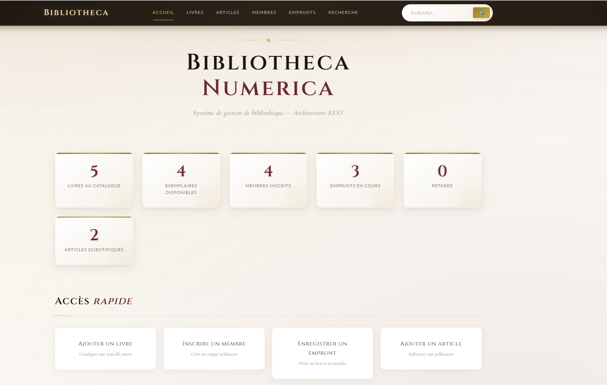
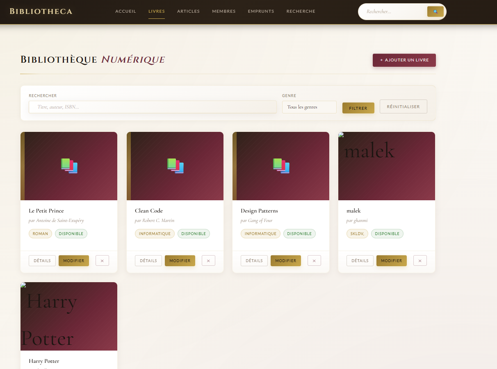
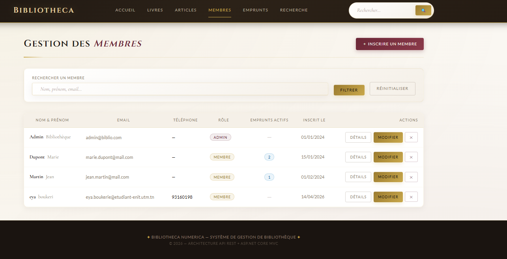
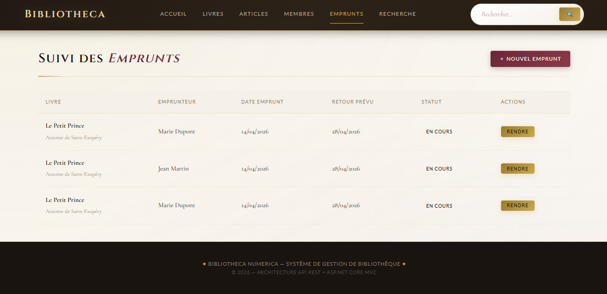
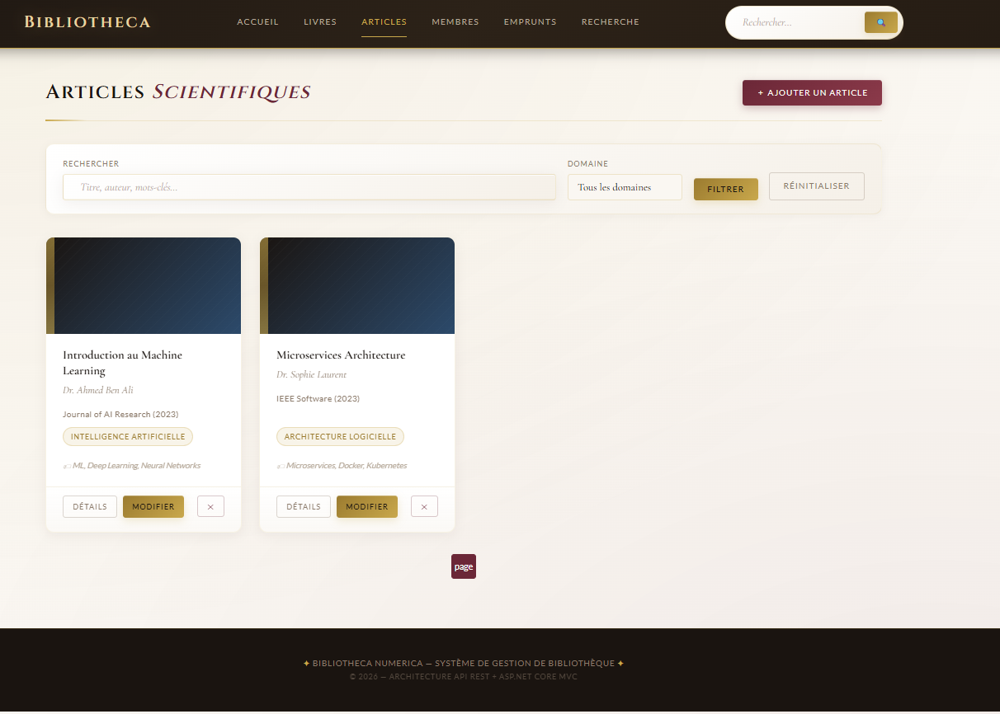
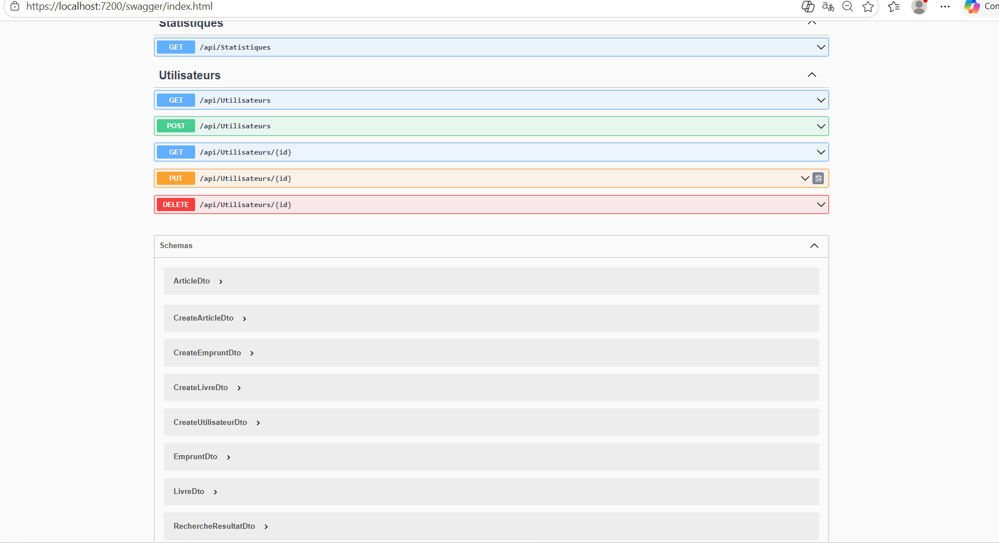

<div align="center">

<br/>

```
╔══════════════════════════════════════════════════════════════╗
║                                                              ║
║          ██████╗ ██╗██████╗ ██╗     ██╗ ██████╗             ║
║          ██╔══██╗██║██╔══██╗██║     ██║██╔═══██╗            ║
║          ██████╔╝██║██████╔╝██║     ██║██║   ██║            ║
║          ██╔══██╗██║██╔══██╗██║     ██║██║   ██║            ║
║          ██████╔╝██║██████╔╝███████╗██║╚██████╔╝            ║
║          ╚═════╝ ╚═╝╚═════╝ ╚══════╝╚═╝ ╚═════╝             ║
║                                                              ║
║              N  U  M  E  R  I  C  A                         ║
║                                                              ║
╚══════════════════════════════════════════════════════════════╝
```

# 📚 Bibliotheca Numerica

### *Digital Library Management System — REST Architecture*

<br/>

[](https://dot.net)
[](https://docs.microsoft.com/aspnet/core)
[](https://docs.microsoft.com/ef/)
[](https://www.microsoft.com/sql-server)
[](https://swagger.io)

<br/>

> **Two separate Visual Studio solutions architecture.**
> A robust REST API + an MVC web interface with a luxurious 3D design.

<br/>

</div>

---

## 📸 Application Preview

### 🏛 Dashboard — 3D Overview



> *Real-time animated statistics — 3D counters, quick access to all modules*

---

### 📖 Books Catalog



> *3D card grid with tilt effect on hover, availability badges, filters and search*

---

### 👥 Members Management



> *Complete members table with roles, active loans and history*

---

### 🔖 Loans Management



> *Track active loans, automatically detected overdue returns, penalty calculation*

---

### 📄 Scientific Articles



> *Articles catalog with domain filters, keywords and DOI access*

---

### 🔍 REST API — Swagger UI



> *Full interactive documentation of all REST endpoints*

---

## 🏗 Architecture — Two Separate Solutions

```
┌──────────────────────────────────────────────────────────────────┐
│                                                                  │
│  SOLUTION 1 : LibraryDatabase    HTTP    SOLUTION 2 : LibraryWebApp│
│  ─────────────────────────────  ◄────►  ──────────────────────── │
│                                                                  │
│  BibliothequeAPI/                        BibliothequeFront/       │
│  ├── Controllers/                        ├── Controllers/          │
│  │   ├── LivresController     REST/JSON  │   ├── HomeController    │
│  │   ├── EmpruntsController   ────────►  │   ├── LivresController  │
│  │   ├── UtilisateursCtrl                │   └── ...               │
│  │   ├── ArticlesController              ├── Services/             │
│  │   └── StatsController                 │   └── ApiService.cs    │
│  ├── Models/                             ├── Models/ViewModels.cs  │
│  │   ├── Livre.cs                        ├── Views/                │
│  │   ├── Utilisateur.cs                  │   ├── _Layout.cshtml    │
│  │   ├── Emprunt.cs                      │   ├── Home/             │
│  │   └── Article.cs                      │   ├── Books/            │
│  ├── Data/BibliothequeContext.cs          │   ├── Loans/            │
│  ├── DTOs/BibliothequeDto.cs             │   └── ...               │
│  └── Program.cs (CORS + Swagger)         └── wwwroot/              │
│                                              ├── css/ (3D Design) │
│  🗄 SQL Server (Port 7200)                   └── js/  (3D Effects)│
│                                          🌐 Browser (Port 7100)   │
└──────────────────────────────────────────────────────────────────┘
```

---

## ⚡ Quick Start

### Prerequisites

| Tool | Version | Link |
|------|---------|------|
| .NET SDK | 8.0+ | [dot.net](https://dot.net) |
| SQL Server LocalDB | included with VS | Installed with Visual Studio |
| Visual Studio | 2022+ | [visualstudio.microsoft.com](https://visualstudio.microsoft.com) |

---

### 🚀 Full Installation in 5 Steps

#### Step 1 — Prepare the projects

```bash
# Extract both ZIPs into their respective folders:
# BibliothequeAPI.zip   → BibliothequeAPI/
# BibliothequeFront.zip → BibliothequeFront/

# Trust the HTTPS certificate (once, required)
dotnet dev-certs https --trust
```

#### Step 2 — Start the API (Solution 1) FIRST

```bash
cd BibliothequeAPI/BibliothequeAPI

# Restore NuGet packages
dotnet restore

# Create the database (Code First)
dotnet ef migrations add InitialCreate
dotnet ef database update

# Start the API
dotnet run
```

> ✅ API available at: **https://localhost:7200**
> ✅ Swagger UI at: **https://localhost:7200/swagger**
> ✅ Seed data is inserted automatically

#### Step 3 — Start the Front (Solution 2) SECOND

```bash
cd BibliothequeFront/BibliothequeFront

# Restore packages
dotnet restore

# Start the interface
dotnet run
```

> ✅ Interface available at: **https://localhost:7100**

#### Step 4 — Via Visual Studio (Package Manager Console)

```powershell
# In Package Manager Console of the BibliothequeAPI project:
Add-Migration InitialCreate
Update-Database
```

#### Step 5 — Simultaneous startup in Visual Studio

```
1. Right-click on the Solution
2. Properties → Startup Project
3. Multiple startup projects
4. BibliothequeAPI   → Action: Start ▶
5. BibliothequeFront → Action: Start ▶
6. Click OK → Press F5
```

---

## 📊 Full Feature List

### 📚 Books Management
| Feature | Description |
|---------|-------------|
| ✅ Paginated list | 3D card grid with pagination |
| ✅ Search | By title, author, ISBN |
| ✅ Filters | Genre, category, availability |
| ✅ Full CRUD | Add, edit, delete, details |
| ✅ Availability | Real-time copy counter |
| ✅ Soft delete | History is preserved |

### 👥 Members Management
| Feature | Description |
|---------|-------------|
| ✅ Full CRUD | Create, read, update, delete |
| ✅ Roles | Admin / Librarian / Member |
| ✅ History | All loans for a given member |
| ✅ Search | By first name, last name, email |

### 🔖 Loans Management
| Feature | Description |
|---------|-------------|
| ✅ Create loan | Select book + member + return date |
| ✅ Record return | With actual return date |
| ✅ Overdue detection | Automatic on every request |
| ✅ Penalties | Auto-calculated at 0.50€/day overdue |
| ✅ Status filters | Active / Overdue / Returned |

### 📄 Scientific Articles
| Feature | Description |
|---------|-------------|
| ✅ Full CRUD | Title, author, journal, DOI, keywords |
| ✅ Domain filters | Filter by scientific domain |
| ✅ Search | By title, author, keywords |
| ✅ DOI link | Direct access to the publication |

### 🔍 Global Search
| Feature | Description |
|---------|-------------|
| ✅ Multi-entity | Books + Articles simultaneously |
| ✅ Counters | Number of results per category |

### 📈 Dashboard Statistics
| Stat | Description |
|------|-------------|
| ✅ Total books | Full catalog count |
| ✅ Available books | Free copies |
| ✅ Registered members | Active accounts |
| ✅ Active loans | Currently borrowed today |
| ✅ Overdue | With visual alert |
| ✅ Articles | Total catalog count |

---

## 🔗 REST API — Full Reference

**Base URL:** `https://localhost:7200/api`

### Books
```http
GET    /api/livres?recherche=...&genre=...&disponible=true&page=1
GET    /api/livres/{id}
POST   /api/livres
PUT    /api/livres/{id}
DELETE /api/livres/{id}
GET    /api/livres/genres
```

### Loans
```http
GET    /api/emprunts?statut=EnCours&utilisateurId=...&page=1
GET    /api/emprunts/{id}
POST   /api/emprunts
PUT    /api/emprunts/retour
```

### Users
```http
GET    /api/utilisateurs?recherche=...&role=...&page=1
GET    /api/utilisateurs/{id}
POST   /api/utilisateurs
PUT    /api/utilisateurs/{id}
DELETE /api/utilisateurs/{id}
```

### Articles
```http
GET    /api/articles?recherche=...&domaine=...&page=1
GET    /api/articles/{id}
POST   /api/articles
PUT    /api/articles/{id}
DELETE /api/articles/{id}
GET    /api/articles/domaines
```

### Utilities
```http
GET    /api/statistiques
GET    /api/recherche?q=search_term
```

---

## 🗄 Data Model

```
┌──────────────┐         ┌─────────────────┐         ┌────────────────┐
│    BOOK      │         │      LOAN       │         │     USER       │
├──────────────┤         ├─────────────────┤         ├────────────────┤
│ Id (PK)      │◄──────N─│ BookId (FK)     │─N──────►│ Id (PK)        │
│ Title *      │  1      │ UserId (FK) *   │      1  │ LastName *     │
│ Author *     │         │ LoanDate        │         │ FirstName *    │
│ ISBN (uniq.) │         │ ExpectedReturn  │         │ Email (uniq.)  │
│ Genre        │         │ ActualReturn    │         │ Role           │
│ TotalCopies  │         │ Status          │         │ Phone          │
│ AvailCopies  │         │ LatePenalty     │         │ JoinDate       │
│ IsActive     │         └─────────────────┘         └────────────────┘
└──────────────┘
                         ┌────────────────┐
                         │    ARTICLE     │
                         ├────────────────┤
                         │ Id (PK)        │
                         │ Title *        │
                         │ Author *       │
                         │ Journal        │
                         │ Domain         │
                         │ DOI            │
                         │ Keywords       │
                         │ Abstract       │
                         │ AccessLink     │
                         └────────────────┘
* = required field
```

---

## 🔧 Configuration

### Solution 1 — `BibliothequeAPI/appsettings.json`

```json
{
  "ConnectionStrings": {
    "BibliothequeDB": "Server=(localdb)\\mssqllocaldb;Database=BibliothequeDB;Trusted_Connection=True;TrustServerCertificate=True"
  },
  "Urls": "https://localhost:7200;http://localhost:5200"
}
```

> 💡 For SQL Server Express, replace `(localdb)\\mssqllocaldb` with `.\\SQLEXPRESS`

### Solution 2 — `BibliothequeFront/appsettings.json`

```json
{
  "ApiSettings": {
    "BaseUrl": "https://localhost:7200/"
  },
  "Urls": "https://localhost:7100;http://localhost:5100"
}
```

### Default Ports

| Solution | Project | HTTPS | HTTP |
|----------|---------|-------|------|
| Solution 1 | BibliothequeAPI | **7200** | 5200 |
| Solution 2 | BibliothequeFront | **7100** | 5100 |

---

## 🐛 Troubleshooting

<details>
<summary><b>❌ "Unable to connect to the remote server"</b></summary>

**Cause**: The API (Solution 1) is not running.

**Fix**:
1. Make sure `BibliothequeAPI` is running on `https://localhost:7200`
2. Open `https://localhost:7200/swagger` → should display Swagger UI
3. Always start Solution 1 **before** Solution 2

</details>

<details>
<summary><b>❌ "SSL Certificate error" / ERR_CERT_INVALID</b></summary>

**Fix**:
```bash
dotnet dev-certs https --trust
```
Then restart your browser.

</details>

<details>
<summary><b>❌ "CORS policy: No 'Access-Control-Allow-Origin' header"</b></summary>

**Fix**: Check in `BibliothequeAPI/Program.cs`:
```csharp
policy.WithOrigins(
    "https://localhost:7100",  // ← your Front port
    "http://localhost:5100"
)
```

</details>

<details>
<summary><b>❌ Razor error RZ3906: "@page directive"</b></summary>

**Fix**: Declare variables in the `@{ }` block:
```razor
@{
    int previousPage = page - 1;
    int nextPage     = page + 1;
}
<a asp-route-page="@previousPage">‹</a>
<a asp-route-page="@nextPage">›</a>
```

</details>

<details>
<summary><b>❌ "Migration already exists"</b></summary>

```bash
# Delete the Migrations/ folder and start over
dotnet ef migrations add InitialCreate
dotnet ef database update
```

</details>

---

## 📁 Repository Structure

```
bibliotheque-numerica/
│
├── 📁 assets/                    ← Screenshots (used in README)
│   ├── dashboard-3d.png
│   ├── Livre.png
│   ├── membre.png
│   ├── emprunt.png
│   ├── Article.png
│   └── swagger-ui.png
│
├── 📦 BibliothequeAPI/           ← SOLUTION 1 — Database + REST API
│   ├── BibliothequeAPI.sln
│   └── BibliothequeAPI/
│       ├── Controllers/          ← 5 REST controllers
│       ├── Models/               ← 4 entities (Book, User, Loan, Article)
│       ├── Data/                 ← DbContext Code First + Seed data
│       ├── DTOs/                 ← Data transfer objects
│       ├── Program.cs            ← CORS + Swagger + Auto-migration
│       └── appsettings.json      ← SQL Server (Port 7200)
│
├── 📦 BibliothequeFront/         ← SOLUTION 2 — MVC Web Interface
│   ├── BibliothequeFront.sln
│   └── BibliothequeFront/
│       ├── Controllers/          ← 5 MVC controllers
│       ├── Models/ViewModels.cs  ← ViewModels
│       ├── Services/ApiService.cs← HTTP client → API ⬅ LINK BETWEEN THE 2
│       ├── Views/                ← 20+ Razor views
│       ├── wwwroot/css/          ← 3D Design (Gold/Bordeaux/Ivory)
│       ├── wwwroot/js/           ← 3D effects + animations
│       ├── Program.cs            ← HttpClient → API
│       └── appsettings.json      ← API URL (Port 7100)
│
├── .gitignore
└── README.md                     ← This file
```

---

## ✅ Startup Checklist

```
□ .NET 8 SDK installed
□ SQL Server LocalDB available
□ dotnet dev-certs https --trust  ← run once

SOLUTION 1 — BibliothequeAPI:
  □ Open BibliothequeAPI.sln
  □ dotnet restore (or NuGet: Restore)
  □ Add-Migration InitialCreate
  □ Update-Database
  □ F5 (or dotnet run)
  □ ✅ https://localhost:7200/swagger works

SOLUTION 2 — BibliothequeFront:
  □ Open BibliothequeFront.sln
  □ dotnet restore
  □ Check appsettings.json: BaseUrl = https://localhost:7200/
  □ F5 (or dotnet run)
  □ ✅ https://localhost:7100 shows the dashboard

FINAL TEST:
  □ Dashboard displays all 6 statistics ✓
  □ Books catalog loaded with seed data ✓
  □ Loan creation works correctly ✓
  □ Swagger UI responds on /swagger ✓
```

---

<div align="center">

<br/>

```
╔══════════════════════════════════════════╗
║                                          ║
║    ✦  Bibliotheca Numerica  ✦            ║
║                                          ║
║    REST Architecture · .NET 8            ║
║    ASP.NET Core MVC · EF Core            ║
║    SQL Server · Swagger UI               ║
║                                          ║
╚══════════════════════════════════════════╝
```

*Built with* ❤️ *— Academic Year 2025-2026*

</div>